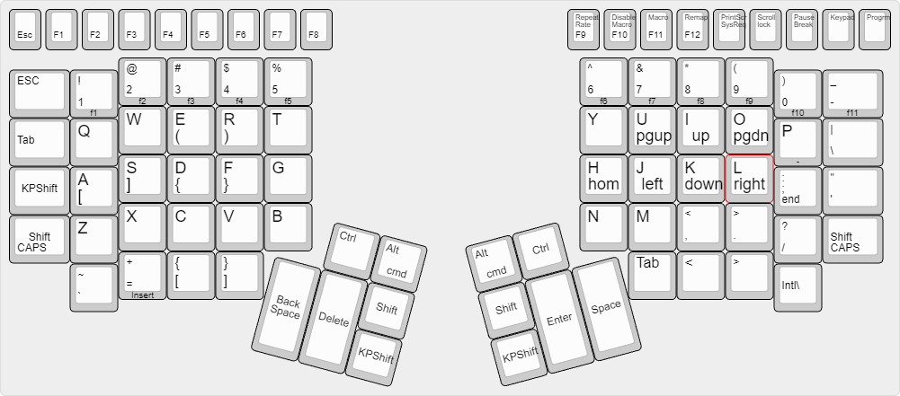

# abraxas
Kinesis Advantage keyboard layout with arrows and brackets layer ("arrows"+"brackets"="abraxas")

kp-layer is great for access to arrows and brackets (see image)
lots of extra spare keys for customizing

note: you lose a number pad 
 
note2: I also like f and j as tap-hold shifts but that requires qmk firmware or KMonad software. Stock Advantage2 firmware can't do it.

Please share any improvements or tweaks you make.

